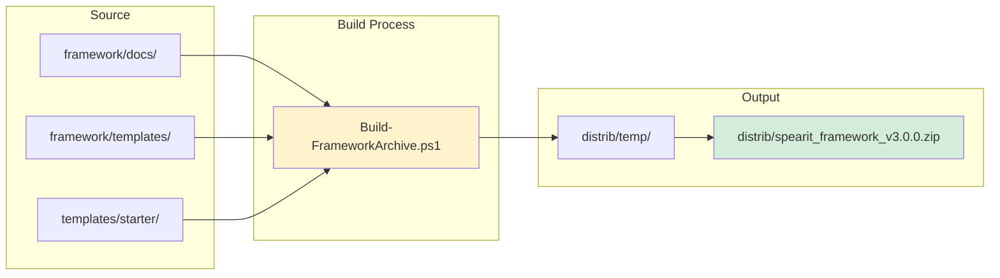
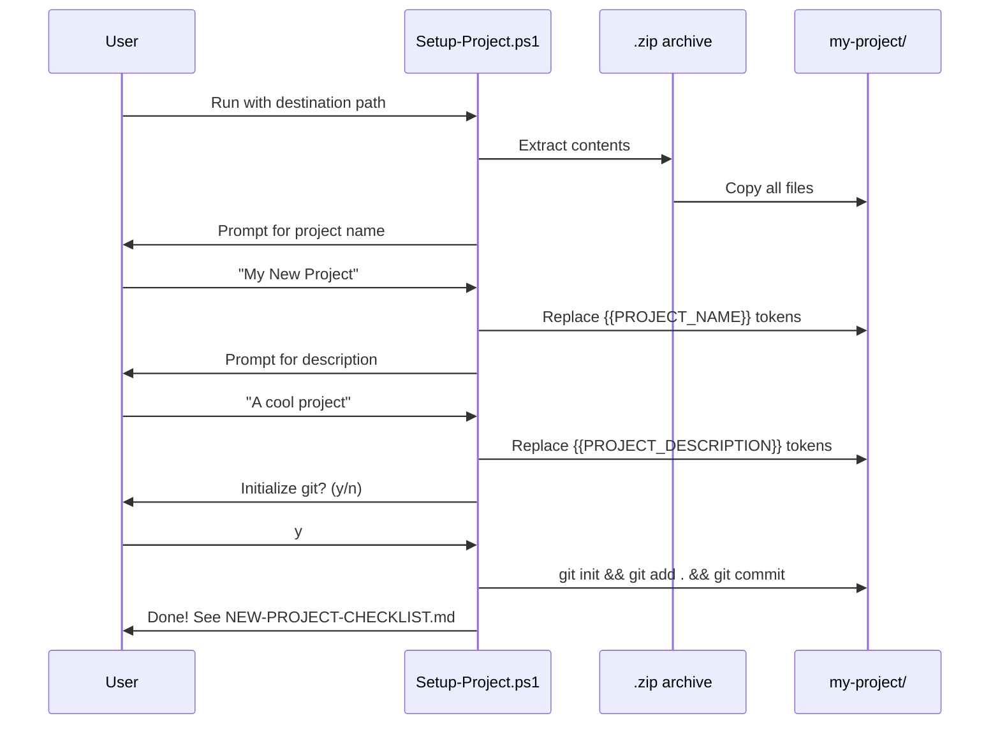
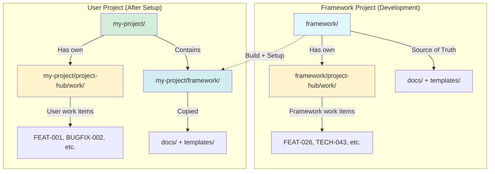

# DECISION-050: Framework Distribution Model

**ID:** DECISION-050.3
**Type:** Decision
**Priority:** Low
**Version Impact:** Minor
**Created:** 2026-01-12
**Updated:** 2026-01-26

---

## Summary

Defines how the SpearIT Framework is packaged and distributed to users.

---

## Decision

**Distribute framework as a zip archive built from live documentation.**

### Key Points

1. **Single zip archive per release** - Contains framework + project scaffolding
2. **Built from live docs** - No separate template maintenance (with minimal exceptions)
3. **Setup script guides installation** - Copies into new projects
4. **Standard tier only** - No minimal/light variants (reduces scope)
5. **Upgrade path deferred** - Separate issue for update workflows
6. **Existing project integration deferred** - Focus on new projects only

---

## Distribution Structure

```
distrib/
├── temp/                                    # Build working area
│   └── spearit_framework_v3.0.0/           # Assembled archive contents
└── spearit_framework_v3.0.0.zip            # Final release artifact
```

### Archive Contents

```
spearit_framework_v3.0.0/
├── framework/                    # ← FROM live framework/
│   ├── docs/
│   │   ├── collaboration/
│   │   ├── process/
│   │   └── patterns/
│   └── templates/
│       ├── work-items/
│       ├── decisions/
│       ├── documentation/
│       └── research/
│
├── project-hub/                     # ← FROM starter template
│   ├── work/
│   │   ├── backlog/
│   │   ├── todo/.limit           # Contains "10"
│   │   ├── doing/.limit          # Contains "1"
│   │   └── done/
│   ├── history/
│   ├── research/
│   ├── retrospectives/
│   └── external-references/
│
├── src/                          # ← Empty scaffolding
├── tests/
├── docs/
│
├── README.md                     # ← FROM starter template (with placeholders)
├── PROJECT-STATUS.md
├── CHANGELOG.md
├── CLAUDE.md
├── INDEX.md
├── framework.yaml
└── .gitignore
```

---

## Content Sources

| Source | Location | Contents |
|--------|----------|----------|
| **Live framework** | `framework/` | `docs/`, `templates/` - copied as-is |
| **Live framework** | `framework/project-hub/` | **EXCLUDED** (framework's own history) |
| **Starter template** | `templates/starter/` | Root docs with `{{PLACEHOLDER}}` tokens |
| **Starter template** | `templates/starter/` | `project-hub/` structure with `.limit` files |
| **Starter template** | `templates/starter/` | Empty `src/`, `tests/`, `docs/` scaffolding |

---

## Build Process

```
Build-FrameworkArchive.ps1 -Version "3.0.0"

1. Create distrib/temp/spearit_framework_v3.0.0/
2. Copy framework/docs/ → temp/framework/docs/
3. Copy framework/templates/ → temp/framework/templates/
4. Copy templates/starter/* → temp/
5. Create zip archive in distrib/
6. Clean up temp folder (optional)
```

---

## Setup Process

```
Setup-Project.ps1 -Destination "C:\Projects\my-new-project"

1. Extract archive to destination
2. Prompt for project name, description
3. Replace {{PLACEHOLDER}} tokens in template files
4. Initialize git repository (optional)
5. Display next steps from NEW-PROJECT-CHECKLIST.md
```

---

## Diagrams

### Diagram 1: Build Flow



### Diagram 2: Setup Flow



### Diagram 3: Framework Dual Identity



**Key Insight:** Framework is BOTH:
- **A project** (when developing framework itself)
- **A dependency** (when copied into user projects)


---

## Summary: Key Concepts

### Framework Has Dual Identity

1. **As a Project (framework/):**
   - Has its own development workflow
   - Has `project-hub/work/` for framework improvements
   - Source of truth for templates, process, collaboration guides

2. **As a Dependency (my-project/framework/):**
   - Copied into user projects during setup
   - Versioned via `framework.yaml`
   - User owns their copy

### Content Separation

| What | Included in Distribution | Notes |
|------|-------------------------|-------|
| `framework/docs/` | Yes | Process and collaboration guides |
| `framework/templates/` | Yes | Work item and decision templates |
| `framework/project-hub/` | **No** | Framework's own work history |
| Starter docs | Yes | From `templates/starter/` |
| Project scaffolding | Yes | Empty folders with `.limit` files |

---

## Decisions Made

| Topic | Decision |
|-------|----------|
| Distribution format | Zip archive |
| Build source | Live framework docs (not separate templates) |
| Tier support | Standard only (no minimal/light) |
| Starter templates location | `templates/starter/` |
| Build working area | `distrib/temp/` |
| Framework history | Excluded from distribution |

---

## Deferred to Separate Issues

| Topic | Rationale |
|-------|-----------|
| **Upgrade workflow** | Complex topic; clearer after initial distribution works |
| **Existing project integration** | Focus on new projects first |
| **`project-hub/` → `project-hub/` rename** | Affects many docs; do separately then build on new structure |

---

## Related Work Items

- **TECH-xxx** (to be created): Rename `project-hub/` to `project-hub/`
- **FEAT-037**: Project config file (may track framework version)

---

## Next Steps

1. Create `templates/starter/` with placeholder-based starter files
2. Create `Build-FrameworkArchive.ps1` script
3. Create `Setup-Project.ps1` script
4. Update `NEW-PROJECT-CHECKLIST.md` to reference new workflow
5. Test end-to-end: build → setup → verify project structure

---

**Last Updated:** 2026-01-26
