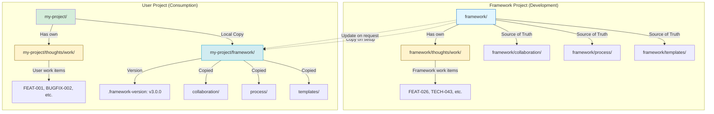
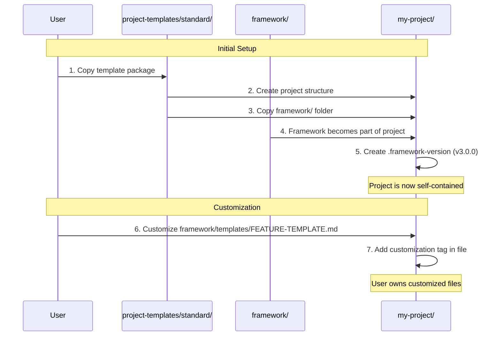
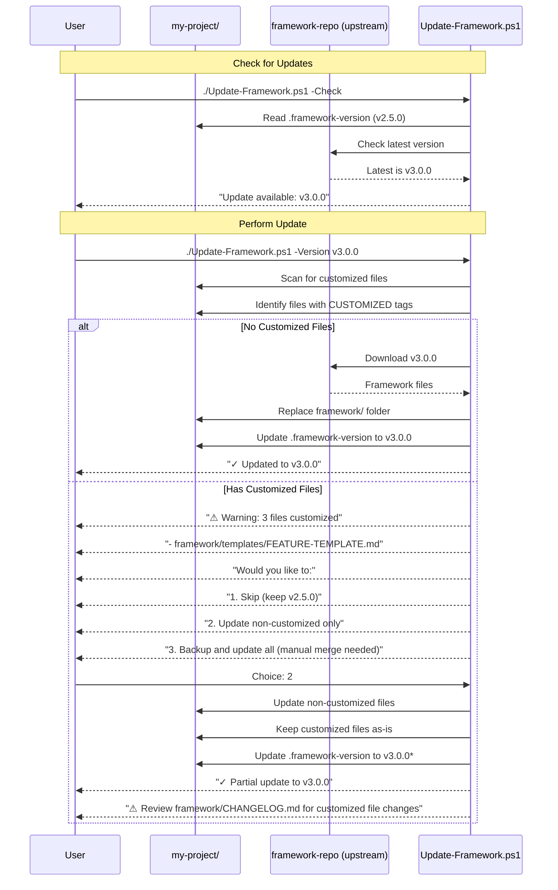
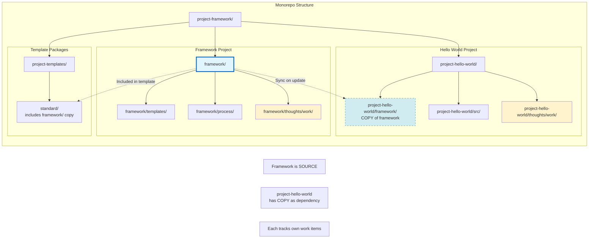
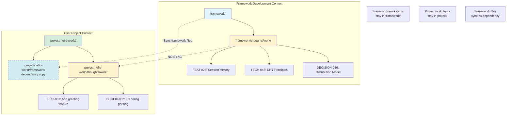

# DECISION-050: Framework Distribution Flow Diagrams

**Supporting Document for:** DECISION-050-framework-distribution-model.md
**Created:** 2026-01-12
**Purpose:** Visual clarification of framework-as-dependency concept

---

## Diagram 1: Framework Lifecycle - Development vs. Dependency



**Key Insight:** Framework is BOTH:
- **A project** (when developing framework itself)
- **A dependency** (when copied into user projects)

---

## Diagram 2: Framework Setup Flow



---

## Diagram 3: Framework Update Flow



---

## Diagram 4: Framework as Project vs. Dependency



**Key Points:**
1. `framework/` = Source project (develops framework itself)
2. `project-hello-world/framework/` = Dependency copy (uses framework)
3. Each maintains separate `thoughts/work/` for their own work items
4. `framework/` work items = framework improvements (FEAT-026, TECH-043)
5. `project-hello-world/` work items = hello-world features (FEAT-001, etc.)

---

## Diagram 5: Work Item Context Separation



---

## Summary: Key Concepts

### Framework Has Dual Identity

1. **As a Project (framework/):**
   - Has its own development workflow
   - Has `thoughts/work/` for framework improvements
   - Tracks FEAT-026, TECH-043, DECISION-050, etc.
   - Source of truth for templates, process, collaboration guides

2. **As a Dependency (my-project/framework/):**
   - Copied into user projects during setup
   - Versioned (`.framework-version`)
   - Can be customized by user (user owns changes)
   - Can be updated from source when user chooses

### Separation of Concerns

- **Framework work items** = Improving the framework itself
  - Location: `framework/thoughts/work/`
  - Examples: FEAT-026, TECH-043, DECISION-050

- **Project work items** = User's project features
  - Location: `my-project/thoughts/work/`
  - Examples: FEAT-001 (add feature), BUGFIX-002 (fix bug)

### Update Model

- User controls when to update framework
- Can customize framework files (user owns them)
- Update script helps identify conflicts
- Version tracking enables informed decisions

---

## Open Questions / Discussion Points

1. **Update Script Complexity:**
   - MVP: Manual instructions ("copy framework/ from latest release")
   - v2: `Update-Framework.ps1` with conflict detection
   - v3: Smart merge tool

   **When to build?** Start with MVP (documentation), build tooling if validated by usage?

2. **Framework Exclusions:**
   - Should user projects copy `framework/thoughts/`?
   - **Recommendation:** NO - framework's work items are not relevant to users
   - Only copy: templates, process, collaboration, patterns, docs

3. **Customization Tagging:**
   - Standard format for marking customizations?
   ```markdown
   <!-- CUSTOMIZED: Modified from framework v2.5.0 on 2026-01-12 -->
   <!-- REASON: Added project-specific validation fields -->
   ```

4. **Integration with FEAT-037 (Project Config):**
   - Should `project-config.yaml` track framework version and customizations?
   ```yaml
   framework:
     version: "3.0.0"
     customizedFiles:
       - framework/templates/FEATURE-TEMPLATE.md
   ```

---

**Last Updated:** 2026-01-12
